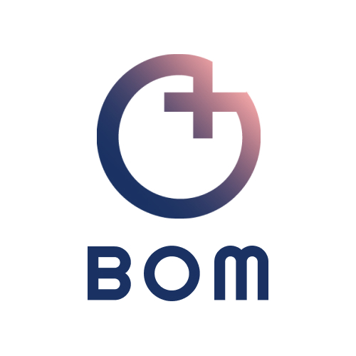

# BOM



**BOM**은 메디컬 웨어러블 서비스로, **보다**라는 의미와 환자의 **봄**을 이중적으로 표현하고자 하였습니다. 본 프로젝트는 환자의 건강 정보를 모니터링해 실시간으로 위험을 감지할 수 있게 합니다. 또한 웨어러블 디바이스에서 필수적인 배터리 관리를 제공하며, 이 모든 정보를 웹을 통해 통합 관리할 수 있는 **웹 IoT 서비스**입니다.


[toc]

## 설치

> 자세한 내용은 [포팅 메뉴얼]() 참고

- FE

> 파일 위치 : ./FE/bom

```bash
// 로컬에서 이용시 설치
$ npm i
$ npm start
```

- BE

> 파일 위치 : ./BE

```bash
$ python manage.py runserver
```


## 사용 방법

사이트 주소 : https://thundervolt.co.kr

병동 로그인

```tex
ID : sw507
PASSWORD : xptmxmdlqslek
```

환자(보호자) 로그인

```tex
ID : 225070001
PASSWORD : xptmxmdlqslek
```


## Embeded

[boms 코드정보]()

[health 코드 정보]()

외관


## WEB

### BE

[코드정보](./BE/)

[API.md](./BE/API.md) 참고


### FE

[코드정보](./FE/bom/)

> bom폴더에서 vscode 실행 후 api 연결 포트 선택

```bash
// ./FE/bom/src/api/UserApi.js

// 로컬에서 실행할 경우
baseURL: "http://127.0.0.1:8000/api/"

// 배포용 API 주소
baseURL: "https://thundervolt.co.kr/api/",
```


## Docs

[문서 모음](./Docs)


## ERD

[ERD]()


## Convention
[🔗 깃 컨벤션](./GitConvention.md)
[🔗 지라 컨벤션](./JiraConvention.md)


## 팀원

권경민(팀장)

- 담당 파트 : HW, FE
- 기타 : onshape (3D), 발표

김유민

- 담당 파트 : HW, BE
- 기타 : 회로 설계

문요성

- 담당 파트 : FE
- 기타 : Figma, PPT

이지수

- 담당 파트 : BE
- 기타 : UCC

정진아

- 담당 파트 : FE
- 기타 : Figma, PPT
